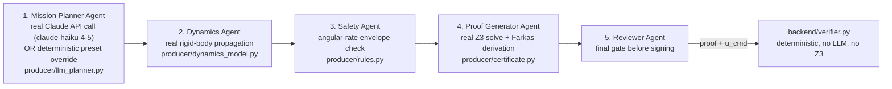
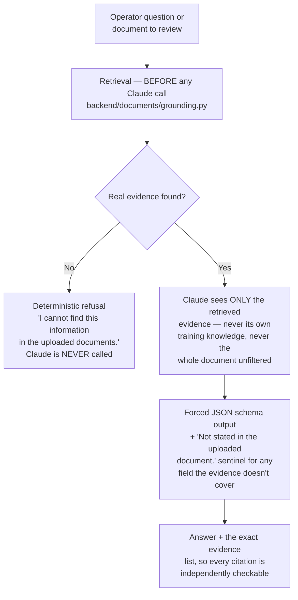

# AI Agents in First Light

Two distinct, clearly-separated categories exist. Confusing them is a real
mistake this document exists to prevent:

1. **The locked Proof-Carrying Commands pipeline** (`producer/pipeline.py`) —
   5 agents that propose and verify spacecraft commands. Frozen research.
2. **Engineering agents** (`backend/agents/*.py`) — deterministic or
   Claude-backed agents that operate on mission *context* (documents,
   telemetry, spacecraft config). Cannot propose commands or influence
   verification. Built on a shared, real observability framework.

No agent in either category is a black box: every one exposes real status,
input, output, latency, and (where applicable) evidence, dependencies, and
version — see the framework section below.

## Category 1: The Proof-Carrying Commands pipeline (locked)

Every step's `latency_ms`, `confidence`, `reasoning_summary`, `status`, and
`dependencies` (real — computed from which prior step's outputs actually feed
a step's inputs, see `producer/pipeline.py::_compute_dependencies`) are
returned in every `propose` response and shown live on the **Multi-Agent
Pipeline** screen. This is the one agent chain that can affect a real
verification outcome — and its outcome is *never trusted directly*: the
deterministic verifier re-derives everything from the certificate's raw
numbers, exactly the point of the producer/verifier asymmetry.

## Category 2: Engineering agents

| Agent | Type | LLM? | File | Version |
|---|---|---|---|---|
| Mission Intake | Deterministic | No | `backend/agents/mission_intake.py` | 1.0.0 |
| Spacecraft Configuration Engine | Deterministic | No | `backend/engines/spacecraft_config.py` | 1.0.0 |
| Telemetry Analysis Engine | Deterministic | No | `backend/engines/telemetry_analysis.py` | 1.0.0 |
| Mission Knowledge Agent | Grounded | Claude (claude-haiku-4-5) | `backend/agents/mission_knowledge.py` | 1.0.0 |
| Paper Review Agent | Grounded | Claude | `backend/agents/paper_review.py` | 1.0.0 |
| Algorithm Review Agent | Grounded | Claude | `backend/agents/algorithm_review.py` | 1.0.0 |
| Scientific Comparison Agent | Grounded | Claude | `backend/agents/scientific_comparison.py` | 1.0.0 |
| Mission Assistant | Narration | Claude | `backend/mission_assistant.py` | — |

Versions are a real, hand-maintained constant
(`backend/agents/base.py::AGENT_VERSIONS`) — `1.0.0` for all of them
honestly reflects that this is a first release, not a fabricated history.

### The shared observability framework

Every "Deterministic"/"Grounded" agent above runs through
`backend/agents/base.py::run_agent`, which:
- times execution (real `time.perf_counter()`, not estimated)
- persists a real row to `agent_runs` — `mission_id`, `agent_name`, `status`
  (`OK`/`ERROR`), `input_summary`, `output_json` (includes `agent_version`),
  `error_message`, `latency_ms`, `created_at`
- never silently swallows a failure — an agent that raises is recorded as a
  real `ERROR` with the actual exception message

Queryable per mission via `GET /api/missions/{id}/agent-runs`, and shown on
the **Multi-Agent Pipeline** screen's execution-history table.

### Deterministic agents (no LLM — by design, not by limitation)

- **Mission Intake** — detects duplicate uploads (real sha256 equality),
  corrupt/unsupported files (real extraction status), and missing fields
  (real checks against `missions.tle_line1`, `spacecraft`, `telemetry`
  tables). Runs automatically after every document upload.
- **Spacecraft Configuration Engine** — validates real per-component-type
  required parameters (reaction wheels, thrusters, batteries, ...),
  physically-implausible-value sanity warnings (never rejects on a
  heuristic), missing-subsystem warnings. Persists to `spacecraft_components`.
- **Telemetry Analysis Engine** — real numpy statistics: sampling frequency
  (median inter-sample interval), packet gaps (>3× median, a plain
  statistical threshold), per-sensor min/max/mean/std, linear-regression
  trends (`numpy.polyfit`), time-synchronization check.

None of these three make an API call to Claude or any other LLM — there is
nothing in their task that benefits from one, and adding an LLM call where a
deterministic check suffices would be exactly the "decorative agent"
anti-pattern this platform's own design principles reject.

### Grounded (Claude-backed) agents — the document pipeline

This is the mechanism that makes **Mission Knowledge**, **Paper Review**,
**Algorithm Review**, and **Scientific Comparison** trustworthy rather than
"a chatbot with extra steps": retrieval happens first, in real code, and the
refusal path never touches the network. A real bug in this exact mechanism
(stopwords inflating match scores, letting an unrelated question slip past
the refusal) was found via live testing and fixed — see `CHANGELOG.md`.

- **Mission Knowledge Agent** — answers a free-form question, cites
  `[filename, page/section]`.
- **Paper Review Agent** — structured review of one uploaded paper:
  research objective, problem statement, methodology, assumptions,
  mathematical models (named, never reproduced as equations — PDF equations
  are rendered as glyphs/vector graphics, not machine-readable math, so
  `backend/documents/structure.py` always reports
  `"Equation extraction unavailable."` rather than guessing), algorithms
  discussed, strengths, limitations, future work, datasets, experimental
  setup, engineering risks.
- **Algorithm Review Agent** — algorithm summary, inputs, outputs,
  **complexity only if the document states one** (Claude is explicitly
  instructed never to compute/estimate Big-O from code structure),
  dependencies, assumptions, failure modes, potential improvements,
  implementation checklist, engineering risks.
- **Scientific Comparison Agent** — compares two documents: similarities,
  differences, assumptions comparison, conflicts, future-work comparison,
  every claim attributed to "Document A" or "Document B".

All three share `backend/agents/_grounded_review.py`: a forced JSON schema
per call (same `output_config` pattern as the locked Mission Planner's real
torque proposal call), and the `"Not stated in the uploaded document."`
sentinel Claude must return verbatim rather than paraphrase or fabricate.

### Mission Assistant

Narrates already-computed mission data (status, analytics) in plain
language. **Never verifies anything, never proposes a command** — it's
explanation, not decision-making. Deterministic fallback narrates the exact
same real data if Claude is unavailable.

## Honest limitations of this agent architecture

- Grounded agents' citations are not automatically verified — nothing checks
  that a cited page actually contains the cited text. Manual spot-checking
  during development confirmed correctness in every live test run this
  session, but this is not an automated guarantee. See `ROADMAP.md`.
- Algorithm Review's "never invent complexity" is an instruction to Claude,
  not a code-level enforcement — Claude could still ignore it. No automated
  check verifies the returned `complexity` field is literally quoted from
  the evidence.
- No embeddings-based semantic retrieval — grounding is real term-frequency
  keyword matching. A synonym-phrased question can legitimately fail to find
  real evidence that exists under different words, and will refuse rather
  than answer.
