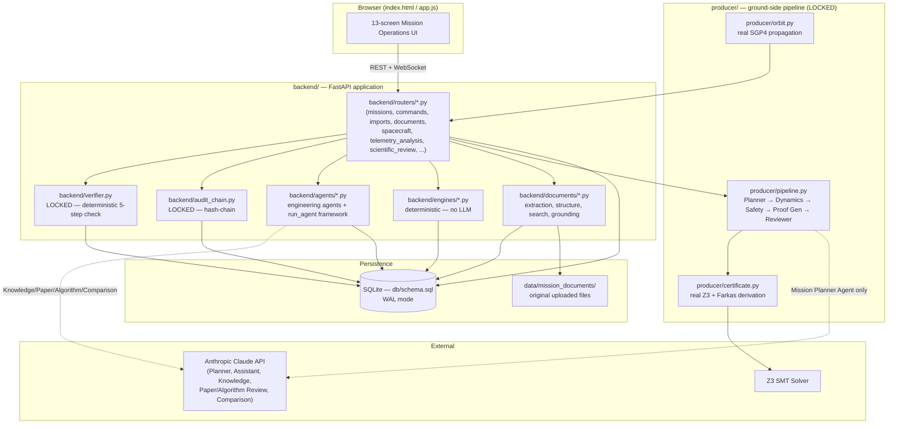
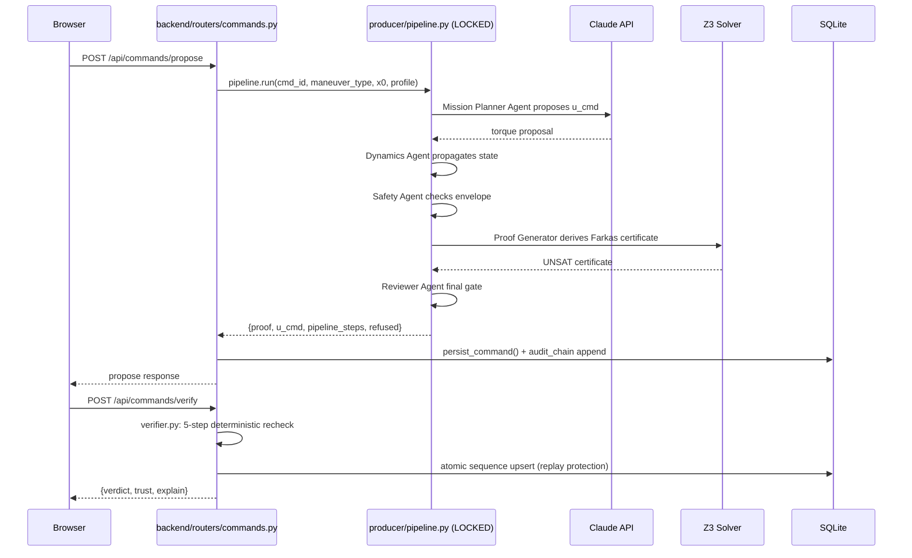
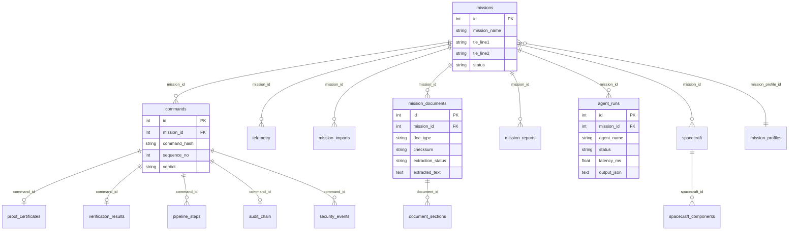

# Architecture

This document maps the real module structure and request flow. For *why*
specific decisions were made (SQLite vs. a client-server DB, the
producer/verifier split, etc.), see [`SYSTEM_DESIGN.md`](SYSTEM_DESIGN.md).
For the locked verification research specifically, see
[`VERIFICATION_PIPELINE.md`](VERIFICATION_PIPELINE.md).

## Component map



**Locked, frozen research** (never modified by surrounding-platform work):
`backend/verifier.py`, `backend/audit_chain.py`, `producer/pipeline.py`,
`producer/certificate.py`. See [`VERIFICATION_PIPELINE.md`](VERIFICATION_PIPELINE.md).

## Directory layout

```
backend/
  routers/        REST + WebSocket API — one file per resource area
  agents/         Engineering-agent execution framework + 5 real agents
                   (NOT the locked producer/pipeline.py multi-agent chain)
  engines/        Deterministic engines (Spacecraft Config, Telemetry
                   Analysis) — explicitly no LLM call
  documents/       Mission Files: extraction, structure, search, grounding
  imports/          Structured-data import validators (TLE, OMM, CSV, ...)
  plugins/           SafetyPropertyPlugin interface (unimplemented, unwired)
  verifier.py          LOCKED — the 5-step deterministic verifier
  audit_chain.py        LOCKED — tamper-evident hash chain
  digital_twin.py        Deterministic physics simulator
  db.py, models.py         SQLAlchemy Core over db/schema.sql

producer/         Ground-side mission-planning pipeline — LOCKED
  agent.py, llm_planner.py    Mission Planner Agent (real Claude call)
  dynamics_model.py            Dynamics Agent
  rules.py                      Flight Rules Engine
  certificate.py                  Proof Generator Agent (real Z3/Farkas)
  pipeline.py                      Orchestrates all 5 agents
  orbit.py                          Real SGP4 propagation

apps/gate, apps/target   cFS-pattern C reference verifier (not a live cFE build)
db/schema.sql            Source-of-truth SQLite schema
eval/                     pytest suite against the live backend (157 tests)
index.html / app.js / styles.css   Mission Operations dashboard
```

## API flow (a single propose → verify request)



## Database schema (real tables, `db/schema.sql`)



See `db/schema.sql` for the complete, authoritative DDL — this diagram covers
the tables most relevant to understanding the platform, not every index.

## Related documents

- [`SYSTEM_DESIGN.md`](SYSTEM_DESIGN.md) — design decisions and trade-offs
- [`VERIFICATION_PIPELINE.md`](VERIFICATION_PIPELINE.md) — the locked PCC research
- [`AGENTS.md`](AGENTS.md) — every AI agent, real vs. simulated vs. deterministic
- [`MISSION_WORKFLOW.md`](MISSION_WORKFLOW.md) — the real operator workflow
- [`README.md`](README.md) — the full narrative writeup with honesty notes throughout
