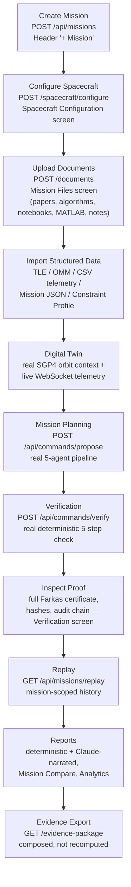
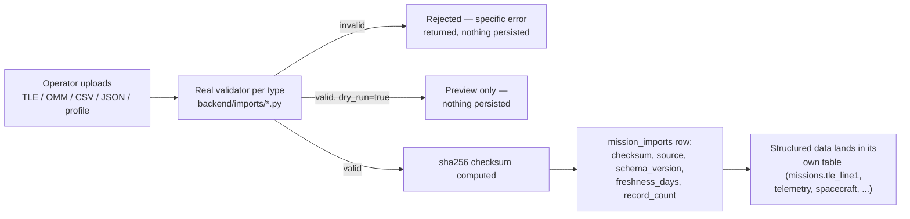

# Mission Workflow

The real operator workflow this platform supports, mapped to actual UI
screens and API endpoints — not an aspirational description.

## Step-by-step, with real endpoints

| Step | Screen | Real endpoint(s) |
|---|---|---|
| Create mission | Header, any screen | `POST /api/missions` |
| Configure spacecraft | Spacecraft Configuration | `POST /api/missions/{id}/spacecraft/configure` |
| Upload documents | Mission Files | `POST /api/missions/{id}/documents` |
| Import TLE/OMM/CSV/JSON/profiles | Digital Twin, Telemetry, Settings | `POST /api/missions/{id}/imports/{type}` |
| Orbit context | Digital Twin | `GET /api/missions/{id}/orbit-context` |
| Digital Twin telemetry | Digital Twin | WebSocket `/ws`, `GET /api/telemetry/latest` |
| Propose a maneuver | Mission Planning | `POST /api/commands/propose` |
| Verify | (automatic after propose) | `POST /api/commands/verify` |
| Inspect proof | Verification | proof detail rendered from the propose/verify response; `GET /api/audit/chain`, `GET /api/audit/verify` |
| Run engineering agents | Mission Files, Telemetry, Multi-Agent Pipeline | `POST /intake/run`, `POST /telemetry-analysis/run`, `POST /knowledge/ask`, `POST /documents/{id}/review/{paper|algorithm}`, `POST /documents/compare` |
| Replay | Replay | `GET /api/missions/replay?mission_id=` |
| Reports | Reports | `GET /analytics`, `GET /api/missions/compare`, `POST /reports/generate`, `POST /assistant/explain` |
| Evidence export | Evidence | `GET /api/missions/{id}/evidence-package` |

## Mission Import Pipeline (structured data)

Validators, real and specific per type: NORAD mod-10 checksum (TLE), the
real `sgp4.omm` library's own construction check (OMM), full-row numeric
validation against the `telemetry` table's actual `NOT NULL` columns (CSV —
all-or-nothing, no partial import), JSON schema checks (Mission
JSON/Spacecraft/Constraint Profile). See `backend/imports/*.py`.

**A deliberate safety boundary:** Constraint Profile imports are validated
and recorded for provenance, but **never written into the `mission_profiles`
table the verifier actually enforces** — see `backend/imports/constraint_profile.py`
for why, and `eval/test_imports.py`'s
`test_constraint_profile_import_never_touches_live_verifier_envelope` for the
regression test proving it.

## What happens when something is unsupported

Every stage in this workflow refuses honestly rather than guessing:
- An unrecognized document extension → `extraction_status: "UNSUPPORTED"`,
  file still stored, no fabricated text.
- A corrupt PDF/notebook → `extraction_status: "CORRUPT"`, real parse error
  surfaced.
- An image → `extraction_status: "NOT_APPLICABLE"` (OCR/vision not
  implemented — see `ROADMAP.md`), never silently skipped without saying so.
- A Knowledge/Paper/Algorithm/Comparison question with no matching evidence →
  a deterministic refusal, no Claude call.
- An invalid import (bad TLE checksum, missing CSV column, malformed OMM) →
  a specific real validation error, nothing persisted.
