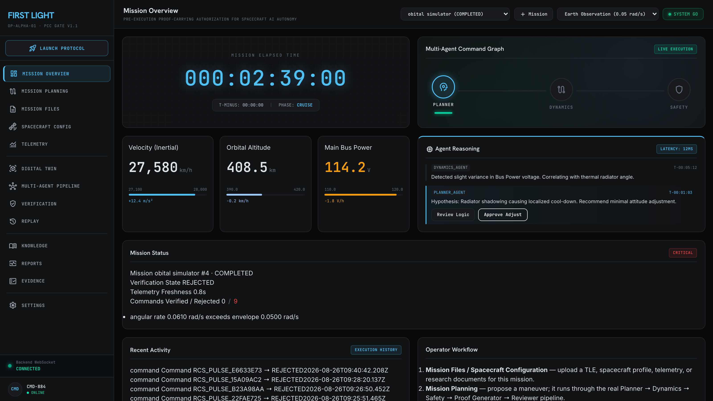
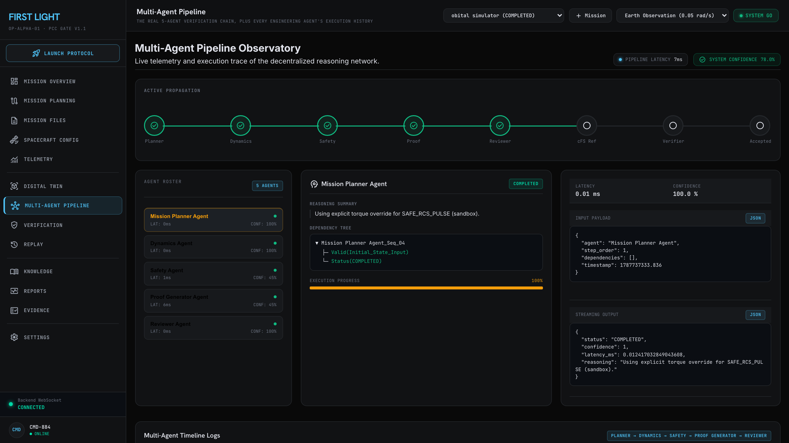
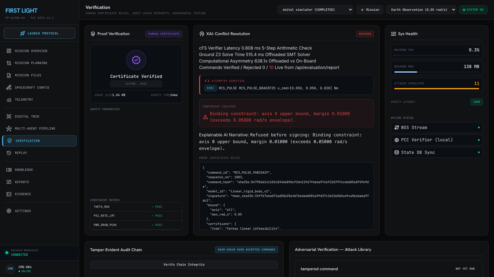
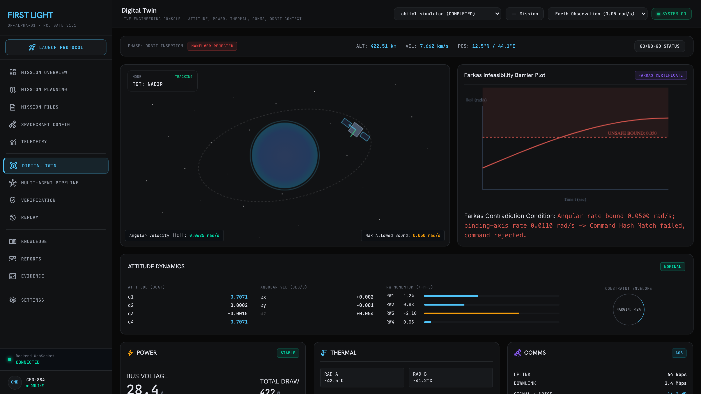
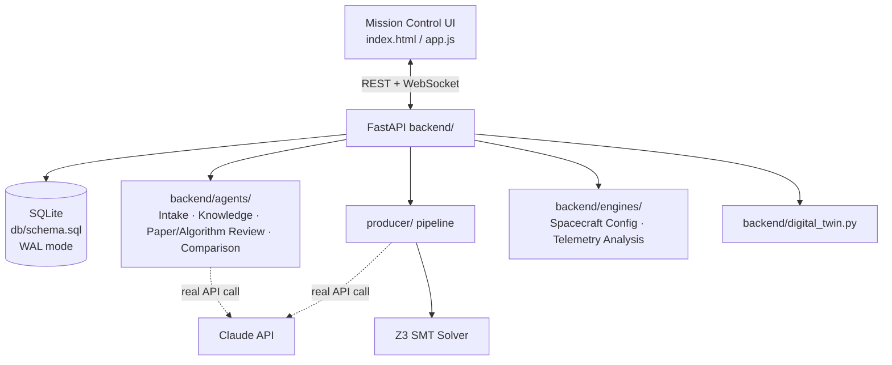
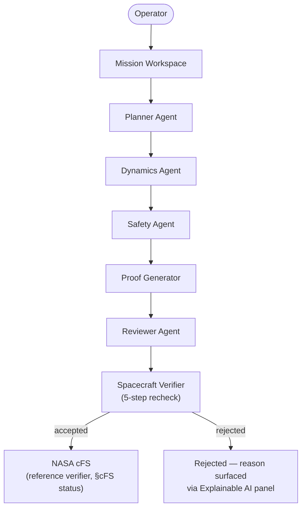

<h1 align="center">FIRST LIGHT</h1>
<p align="center"><strong>Proof-Carrying Commands for AI-Generated Spacecraft Operations</strong></p>
<p align="center">NASA cFS &nbsp;•&nbsp; Z3 &nbsp;•&nbsp; Farkas Certificates &nbsp;•&nbsp; Digital Twin &nbsp;•&nbsp; Mission AI</p>

<p align="center">
  
  
  
  
  
  
  <br>
  
  
  <a href="https://github.com/jaisogani-ai/First-Light/stargazers"></a>
</p>

<p align="center">
  <a href="#what-is-first-light">What is it</a> ·
  <a href="#-innovation--impact">Innovation</a> ·
  <a href="#product-screenshots">Screenshots</a> ·
  <a href="#key-features">Features</a> ·
  <a href="#system-architecture">Architecture</a> ·
  <a href="#ai-agents">Agents</a> ·
  <a href="#run-locally">Run locally</a> ·
  <a href="#demo-flow-23-minutes">Demo flow</a> ·
  <a href="#nasa-cfs-integration--honest-status">cFS status</a> ·
  <a href="#limitations">Limitations</a>
</p>

---

**Track:** Aerotech & Aerospace Innovation — International Innovation Challenge 3.0 (IIC 3.0), Manipal University Jaipur

### 60-Second Overview

- **Problem:** an AI agent proposing spacecraft maneuvers can't be trusted blindly, but re-running a full safety solve on the flight computer is too expensive.
- **Solution:** the AI proves safety on the ground (a real Z3 SMT solve → Farkas certificate); the spacecraft only re-checks the proof's own arithmetic — no second solve, sub-millisecond.
- **Proof it's real:** 13 live agents, 157 passing tests, a working FastAPI backend, and 4 unedited screenshots below — captured from an actual unsafe maneuver getting refused by the live verifier, this session.
- **Where the line is:** no live NASA cFE build (see [cFS status](#nasa-cfs-integration--honest-status)); one Flight Rule implemented so far; full list in [Limitations](#limitations).

**Deep-dive references** (this README is the map; these are the territory): [`ARCHITECTURE.md`](ARCHITECTURE.md) (component map, DB schema, API flow) · [`SYSTEM_DESIGN.md`](SYSTEM_DESIGN.md) (design trade-offs) · [`VERIFICATION_PIPELINE.md`](VERIFICATION_PIPELINE.md) (the locked PCC research) · [`AGENTS.md`](AGENTS.md) (every agent, real vs. simulated) · [`MISSION_WORKFLOW.md`](MISSION_WORKFLOW.md) · [`SECURITY.md`](SECURITY.md) · [`ROADMAP.md`](ROADMAP.md) · [`CHANGELOG.md`](CHANGELOG.md) · [`CONTRIBUTING.md`](CONTRIBUTING.md)

---

## What Is First Light

AI mission-planning agents are increasingly proposed for spacecraft autonomy, but they cannot be trusted to execute commands without independent safety verification — and re-running a full safety solve on board is too expensive for a flight computer. Existing approaches are either **reactive runtime monitors** (catch violations after they start) or **ground-side rule engines** (slow, human-in-the-loop). Neither gives a flight computer a way to *cheaply and independently* verify that an AI-proposed command is safe before it executes.

**Proof-Carrying Commands (PCC)** is the answer this project implements: the ground-side AI agent does the expensive work — an SMT/Z3 solve that derives a mathematical certificate of safety — and attaches that certificate to the command. The spacecraft-side verifier never re-solves anything; it recomputes a small, deterministic arithmetic check over the certificate's own stated numbers. That producer/verifier **computational asymmetry** (milliseconds of solving, sub-millisecond of checking) is the entire point, and it is the one piece of this project that has not changed since the original design.

This is a research prototype, not flight-qualified software. Section [Honest Status](#nasa-cfs-integration--honest-status) and [Limitations](#limitations) say exactly where the line is.

## 🏆 Innovation & Impact

### Novelty
Most "AI safety for autonomy" work is either a reactive runtime monitor (catches a violation after it starts) or a slow ground-side rule engine. First Light instead makes the AI agent *prove* safety before the command ever reaches the spacecraft, and makes that proof cheap enough to re-check on a flight computer — a genuinely different mechanism from the closest published prior art (see [Research](#research)), not a relabeled dashboard.

### User Benefit
Mission operators get an auditable reason for every rejected command (the Explainable AI panel below), instead of a black-box "no." Spacecraft autonomy researchers get a working reference implementation of Proof-Carrying Commands they can extend with their own Flight Rules.

### Technical Innovation
The hard part is real: a live Z3 SMT solve that derives a Farkas infeasibility certificate on the ground, and a spacecraft-side verifier that re-derives the same conclusion from raw numbers in under a millisecond — with **no second SMT solve on board**. That's the producer/verifier computational asymmetry the whole design turns on, and it's implemented, tested, and benchmarked, not simulated.

### Prototype Maturity
Every feature in [Key Features](#key-features) has a live FastAPI endpoint, a passing test in the 157-test adversarial suite, and a real UI screen — not a mockup. The [Limitations](#limitations) section lists, without euphemism, everything that is *not* built yet.

### Scalability
The verification core (`backend/verifier.py`) has zero external dependencies at check time — no network call, no LLM, no solver — so it is the part of the system best positioned to move onto flight-representative hardware. SQLite and in-memory rate limiting are the two components that would need to change first for a multi-spacecraft deployment; both are explicitly flagged in [Limitations](#limitations), not hidden.

### Commercial / Deployment Potential
The verifier's design goal — cheap, independent, on-board re-checking of an AI-proposed command — applies beyond spacecraft to any domain where an expensive AI planner needs a cheap safety gate before actuation: industrial robotics, autonomous ground vehicles, and drone flight authorization are the nearest adjacent markets.

## Product Screenshots

| Mission Overview | Multi-Agent Pipeline |
|:---:|:---:|
|  |  |
| Live mission health, agent reasoning, and command feed — the operator's first screen | The real 5-agent Planner → Dynamics → Safety → Proof → Reviewer chain, with per-agent latency, confidence, and raw JSON I/O |

| Verification | Digital Twin |
|:---:|:---:|
|  |  |
| A real maneuver refused by the verifier, with the exact constraint it violated and the full certificate payload | The Farkas infeasibility barrier plot and rigid-body attitude state for the same rejected maneuver |

Every screenshot above is a live capture of the running application — none are mockups. The verification and digital-twin screens were captured immediately after this session ran an unsafe maneuver through the real Planner → Dynamics → Safety → Proof Generator → Reviewer → Verifier pipeline and watched it get refused.

## Key Features

| Feature | What it actually is |
|---|---|
| **Mission Workspace** | Multiple concurrent missions, each with its own safety envelope, sequence-number stream, telemetry, and command history — not a single global session |
| **Mission Control UI** | 13-screen operator workflow (Overview → Planning → Files → Spacecraft → Telemetry → Digital Twin → Pipeline → Verification → Replay → Knowledge → Reports → Evidence → Settings), every screen loading real data on open |
| **Proof-Carrying Commands** | Farkas-style safety certificates derived from a real Z3 SMT UNSAT check, independently re-verified by 5-step arithmetic recomputation (hash, signature, sequence, model, Farkas inequality) |
| **Flight Digital Twin** | Deterministic physics-based simulator — rigid-body attitude propagation, reaction-wheel momentum, thermal RC response, battery SOC, comm/sensor latency — streamed live over WebSocket |
| **Orbit Context** | Real SGP4 propagation (the `sgp4` package) from an imported TLE — position, ground track, visibility windows, orbital period |
| **Tamper-Evident Audit Chain** | A real hash chain over every command; verification independently recomputes every link from current row data, catching a raw-SQL edit at the exact link it happened |
| **Adversarial Attack Library** | 7 real attack types that mutate a genuinely valid certificate and submit it to the live verifier — replay, payload tampering, forged multipliers, and more |
| **Mission Replay** | The full persisted history of every command, certificate, and verdict, straight from the database — no synthesized replay data |
| **Knowledge Agent** | Document-grounded Q&A over uploaded Mission Files — retrieves real evidence first, refuses deterministically (no LLM call) when nothing matches |
| **Scientific Review** | Paper Review, Algorithm Review, and Comparison agents grounded on real extracted document text, citing `[filename, page]` for every claim |
| **Telemetry Analysis Engine** | Deterministic numpy statistics — sampling rate, packet gaps, sensor trends via linear regression — no LLM |
| **Mission Analytics & Evidence Package** | Real DB-aggregate analytics, mission comparison, and a composed evidence bundle (mission + commands + certificates + verdicts + imports) as JSON |
| **Claude Mission Assistant** | Narrates real mission snapshots in plain language; deterministic fallback when no API key is configured — never fabricates when Claude is unavailable |

No feature in this table is aspirational — every one has a live endpoint, a passing test, and (where applicable) a UI screen. See [Limitations](#limitations) for what is explicitly *not* built.

## System Architecture

```mermaid
flowchart LR
    subgraph Ground["Ground Side — producer/"]
        Planner["Mission Planner Agent<br/>(Claude Haiku 4.5 or preset)"]
        Dynamics["Dynamics Agent<br/>rigid-body propagation"]
        Safety["Safety Agent<br/>Flight Rules Engine"]
        Proof["Proof Generator<br/>Z3 SMT + Farkas derivation"]
        Reviewer["Reviewer Agent<br/>independent recheck"]
        Planner --> Dynamics --> Safety --> Proof --> Reviewer
    end

    subgraph Flight["Spacecraft Side — backend/verifier.py"]
        V1["1. Sequence freshness"]
        V2["2. Command hash match"]
        V3["3. Signature valid"]
        V4["4. Model version match"]
        V5["5. Farkas inequality recheck"]
        V1 --> V2 --> V3 --> V4 --> V5
    end

    Reviewer -- "signed certificate" --> V1
    V5 -- "verdict" --> Audit["Tamper-Evident Audit Chain"]
    V5 -- "verdict" --> Twin["Flight Digital Twin"]
```





Full component map, DB schema, and every API route: [`ARCHITECTURE.md`](ARCHITECTURE.md).

## AI Agents

**13 real agents total, in two categories** — the Multi-Agent Pipeline screen's roster panel shows **5** because it displays only the locked, safety-critical Proof-Carrying Commands chain (Planner → Dynamics → Safety → Proof Generator → Reviewer); the other **8** are engineering agents that operate on mission *context* (documents, telemetry, spacecraft config) and never propose or influence a verified command. All 13 rows below are live, not a mix of built and planned.

### Category 1 — Proof-Carrying Commands pipeline (locked, 5 agents)

The only chain that can produce a verified command. Shown live on the Multi-Agent Pipeline screen's roster.

| Agent | Purpose | Deterministic / LLM | Status |
|---|---|---|---|
| **Mission Planner** | Proposes the 3-axis torque command | Real Claude API call (`claude-haiku-4-5`), deterministic preset fallback | Live |
| **Dynamics** | Propagates rigid-body attitude state | Deterministic | Live |
| **Safety** | Evaluates the Flight Rules Engine (angular-rate bound) | Deterministic | Live |
| **Proof Generator** | Derives the Farkas certificate; confirms UNSAT via real Z3 | Deterministic derivation + real Z3 SMT call | Live |
| **Reviewer** | Independently recomputes `Σ(λᵢ·cᵢ)` before allowing a sign-off | Deterministic | Live |

### Category 2 — Engineering agents (context only, 8 agents)

Operate on mission documents, telemetry, and configuration. Cannot propose or influence a verified command.

| Agent | Purpose | Deterministic / LLM | Status |
|---|---|---|---|
| **Mission Intake** | Detects duplicate/corrupt/unsupported uploads and missing mission fields | Deterministic, rule-based | Live |
| **Mission Knowledge** | Grounded Q&A over uploaded Mission Files, refuses when no evidence exists | Real Claude call, evidence-gated | Live |
| **Paper Review** | Structured review of an uploaded research paper | Real Claude call, forced JSON schema | Live |
| **Algorithm Review** | Structured review of an uploaded algorithm description | Real Claude call, forced JSON schema | Live |
| **Scientific Comparison** | Compares two uploaded documents, attributing every claim | Real Claude call, forced JSON schema | Live |
| **Mission Assistant** | Narrates a mission's real analytics snapshot in plain language | Real Claude call, deterministic fallback | Live |
| **Spacecraft Configuration Engine** | Validates spacecraft/component configuration | Deterministic, rule-based | Live |
| **Telemetry Analysis Engine** | Sampling rate, gaps, statistics, trends over real telemetry | Deterministic, numpy | Live |

Full behavior, inputs/outputs, and the real-vs-simulated boundary for each: [`AGENTS.md`](AGENTS.md).

## Mission Workflow



## Project Structure

```
producer/                Ground-side AI mission-planning pipeline
  agent.py                 Mission Planner Agent (maneuver presets)
  llm_planner.py            Real Claude API call — proposes the torque command
  dynamics_model.py          Dynamics Agent's rigid-body propagation engine
  rules.py                    Flight Rules Engine (angular-rate rule)
  certificate.py                Proof Generator — real Z3 call + Farkas derivation
  pipeline.py                    Orchestrates all 5 agents
  orbit.py                        Real SGP4 orbit propagation (mission context only)

backend/                 Spacecraft-side reference verifier + application backend
  verifier.py               The real 5-step verifier, race-free sequence check
  security.py                 SHA-256 / HMAC-SHA256, canonicalization, rate limiting
  digital_twin.py               Physics-based telemetry simulator
  audit_chain.py                 Tamper-evident hash-chain audit log
  pipeline_graph.py               Real dependency graph from actual step data
  routers/                          Full REST + WebSocket API surface
  imports/                           TLE, OMM, CSV telemetry, mission/spacecraft/
                                      constraint profile validators
  documents/                          PDF/DOCX/notebook/Markdown extraction, search
  engines/                             Spacecraft Config, Telemetry Analysis (no LLM)
  agents/                               Mission Intake, Knowledge, Paper/Algorithm
                                        Review, Scientific Comparison
  plugins/                              SafetyPropertyPlugin interface (unimplemented)

apps/gate, apps/target   cFS-pattern C reference verifier (not a live cFE build)
db/schema.sql            Source-of-truth SQLite schema
eval/                     pytest adversarial suite against the live backend
docs/                      Deep-dive documentation and image assets
index.html / app.js / styles.css   Mission Control dashboard
```

## Tech Stack

| Layer | Technology |
|---|---|
| Frontend | Vanilla HTML / CSS / JS — no framework, no build step |
| Backend | FastAPI, Python 3.11, Uvicorn |
| Database | SQLite (WAL mode), SQLAlchemy Core — no ORM migrations |
| AI | Anthropic Claude API (`claude-haiku-4-5`) |
| Verification | Z3 SMT solver, SHA-256 / HMAC-SHA256 |
| Physics / Orbit | Custom rigid-body dynamics, `sgp4` (Vallado/NORAD SGP4) |
| Documents | PyMuPDF, `python-docx` |
| Observability | Prometheus client, `psutil` |
| Testing | pytest, FastAPI `TestClient` |

## Run Locally

```bash
git clone https://github.com/jaisogani-ai/First-Light.git
cd First-Light

pip install -r requirements.txt
python3 -m db.seed              # creates first_light.db, seeds 4 mission profiles
uvicorn backend.main:app --reload
# open http://localhost:8000
```

```bash
python3 demo.py                 # CLI demonstration: one propose + verify cycle, no server needed
```

```bash
pytest eval/ -v                 # full adversarial suite against the live backend — 157 tests
```

```bash
cd docker && docker compose up --build
```

## Demo Flow (2–3 Minutes)

A concrete sequence to see the real safety mechanism work, start to finish:

1. **Mission Overview** — open a mission, note the live telemetry (velocity, altitude, bus power) and the 5-agent command graph.
2. **Mission Planning** — click **Propose Safe RCS Maneuver**, then **Evaluate Z3 Proof & Verify Certificate**. Watch the real Farkas certificate JSON populate — this is a genuine Z3 solve, not a template.
3. **Multi-Agent Pipeline** — see the same run's 5 agents (Planner → Dynamics → Safety → Proof Generator → Reviewer), each with real latency, confidence, and raw I/O.
4. **Verification** — the certificate gets independently re-checked by the deterministic verifier. Try dragging the torque sliders on Mission Planning to a larger value and re-evaluate — watch a real rejection appear here, with the exact constraint that was violated.
5. **Digital Twin** — the same rejection shown as a live Farkas infeasibility plot against the angular-rate bound.
6. **Verification → Attack Library** — click **Run Attack** on any of the 7 scenarios to watch the live verifier catch a tampered or replayed certificate in real time.

Every step above hits a real endpoint — nothing on this path is scripted or pre-recorded.

## NASA cFS Integration — Honest Status

**What this build attempted:** a real NASA cFS Bundle build. `git clone --recursive https://github.com/nasa/cFS.git` succeeded (328MB, all submodules); `gcc`/`cmake`/`git` were all available. The build reached CMake configuration and failed:

```
CMake Error at cmake/arch_build.cmake:706 (message):
  Do not know how to set CFE_SYSTEM_PSPNAME on Darwin system
```

The open-source cFS native/host Platform Support Package is implemented only for Linux and CYGWIN — porting OSAL's POSIX BSP to macOS is a nontrivial subproject, not a build-flag fix. **This build was not completed under a live NASA cFE/Software Bus instance.**

**What exists instead:** `apps/gate/fsw/src/` contains a **C reference implementation** of the same 5-step verifier logic as `backend/verifier.py`, including a from-scratch SHA-256/HMAC-SHA256 verified against RFC 6234/4231 test vectors. It compiles and runs standalone with plain `gcc` — but it has not been built inside an actual cFE application, has not subscribed to a real Software Bus message ID, and has not been tested on target hardware or in QEMU.

## Benchmark

Representative numbers from a local run (`GET /api/evaluation/report`, computed from real DB aggregates — not hardcoded):

| | Producer (Z3 solve + pipeline) | Verifier (arithmetic recomputation) |
|---|---|---|
| **Latency** | ≈ 4–30 ms | ≈ 0.5–1 ms |

The producer/verifier computational asymmetry is genuine and multi-x — not the fabricated "1,990x" figure the original hackathon prototype displayed before this build replaced every mocked component with a real one.

| | Reactive runtime monitor | Ground-side rule engine | First Light (PCC) |
|---|---|---|---|
| Checks before execution | No — catches violations after they start | Yes, but slow / human-in-the-loop | Yes, cheaply and independently |
| On-board re-solve required | N/A | N/A | No — arithmetic recheck only |
| Machine-checkable proof attached to command | No | No | Yes (Farkas certificate) |

## Security

| Check | Mechanism | What it catches |
|---|---|---|
| Sequence freshness | `sequence_state` table, transactional read/write, atomic upsert | Replay of a previously-accepted certificate |
| Command hash match | Real SHA-256 over canonical command bytes | Attaching a valid certificate to a different (tampered) command |
| Signature valid | Real HMAC-SHA256 over the canonical certificate payload | Forged or corrupted certificates |
| Model version match | Registry of accepted `model_id` values | A certificate generated against an unrecognized dynamics model |
| Farkas inequality | Exact recomputation of `Σ(λᵢ·cᵢ)`, requires equality with `max(constraints)` | A certificate whose stated multipliers don't actually prove the stated conclusion |
| Audit chain | Hash-chained `commands` table, independently recomputed on verify | A raw-SQL edit to historical data, caught at the exact link it happened |

`SECRET_KEY` (`FIRST_LIGHT_HMAC_SECRET_KEY`) lives in `.env`, never committed — see `.env.example`. Rate limiting is a thread-safe, bounded, in-memory fixed-window limiter. Full detail: [`SECURITY.md`](SECURITY.md).

## Limitations

- Not flight-qualified software; not certified under any space agency safety standard (NASA-STD-8719.13, DO-178C, ECSS-E-ST-40C). See [`docs/SAFETY_DISCLAIMER.md`](docs/SAFETY_DISCLAIMER.md).
- No live NASA cFE/Software Bus build in this repository — see [cFS status](#nasa-cfs-integration--honest-status).
- Only one Flight Rule (angular rate) is implemented; the registry supports more, but they don't exist yet.
- The Digital Twin is a deterministic simulation, not live spacecraft telemetry.
- Rate limiting is in-memory and per-process — it does not survive a restart or scale across processes.
- The C reference verifier's HMAC key is a compiled-in demo constant, explicitly not suitable for flight use.
- The Attack Library's seven scenarios are synthetically constructed mutations, not recorded real-world attack traffic.
- The Mission Planner Agent's LLM call is unvalidated beyond "does it produce a parseable, safety-checked proposal" — no adversarial or distributional testing of what Claude actually proposes.
- Ground-track/visibility geometry uses a spherical-Earth approximation, not full WGS84 (error ≤ ~0.3% of Earth's radius).
- The plugin architecture (`backend/plugins/base.py`) is an interface only — zero plugins implemented, nothing wired into the verifier.
- No PDF export exists — the Evidence Package is JSON only.
- No operator/user identity exists anywhere — imports and reports are anonymous.
- Producer and verifier share one static, symmetric HMAC secret with no rotation.

The complete, unabridged self-review — including a fixed TOCTOU race, every remaining weakness, and every explicit assumption — lives in the project's version history and [`CHANGELOG.md`](CHANGELOG.md).

## Research

- Black, M. et al. — *Runtime Assurance for Spacecraft Attitude Control* (STARS program). [arXiv:2402.14723](https://arxiv.org/pdf/2402.14723) — closest prior art: same domain, different mechanism (real-time safety filter vs. a carried proof).
- *Watchdogs and Oracles: Runtime Verification Meets LLMs.* [arXiv:2511.14435](https://arxiv.org/pdf/2511.14435) — the same "don't trust the AI, check it cheaply" problem, generalized to LLM-driven autonomy.
- *Glass Box at Orbit* — AI verification for CubeSat autonomy. [arXiv:2606.02967](https://arxiv.org/pdf/2606.02967) — same platform class, constitutional-AI framework rather than a solver-derived certificate.
- *Reproducible and Open-Source Testbed for Satellite Cybersecurity*, ACM REP '25. [DOI: 10.1145/3736731.3746144](https://dl.acm.org/doi/10.1145/3736731.3746144) — a real, labeled attack dataset named as a candidate replacement for the synthetic Attack Library.
- NASA Core Flight System (cFS) — [github.com/nasa/cFS](https://github.com/nasa/cFS)
- Farkas' Lemma — the linear-algebra foundation of the certificate construction in [`producer/rules.py`](producer/rules.py)
- Z3 Theorem Prover — [github.com/Z3Prover/z3](https://github.com/Z3Prover/z3)
- SGP4 — the standard Vallado/NORAD propagation model, via the [`sgp4`](https://pypi.org/project/sgp4/) package
- Open MCT / Yamcs — studied for ops-console density and workflow patterns during the dashboard redesign (no code copied)

## Contributing

Contributions are welcome — see [`CONTRIBUTING.md`](CONTRIBUTING.md) for the workflow, and [`CODE_OF_CONDUCT.md`](CODE_OF_CONDUCT.md) for community standards. Before opening a PR:

1. Run `pytest eval/ -v` — all 157 tests must pass.
2. Keep the locked research contribution (`producer/rules.py`, `producer/certificate.py`, `backend/verifier.py`'s Farkas recheck) unchanged unless the PR is specifically about extending it — see [`VERIFICATION_PIPELINE.md`](VERIFICATION_PIPELINE.md).
3. New capabilities should be honestly labeled real vs. simulated, deterministic vs. LLM — this project's credibility depends on that distinction never blurring.

## License

Everything in this repository is licensed under the **Apache License 2.0** — see [`LICENSE`](LICENSE). `apps/gate`/`apps/target` are a cFS-*pattern* reference verifier written for this project, not a vendored copy of NASA's cFS/cFE source — no NASA Open Source Agreement (NOSA)-covered code is physically present in this repository.

## Acknowledgements

Built for the International Innovation Challenge 3.0 (IIC 3.0), Manipal University Jaipur, Aerotech & Aerospace Innovation track. Thanks to the NASA cFS, Z3, and SGP4 open-source communities whose tools this project builds directly on, and to the researchers whose work is cited in [Research](#research) for positioning this project honestly relative to prior art rather than in a vacuum.
