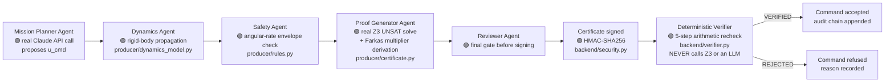
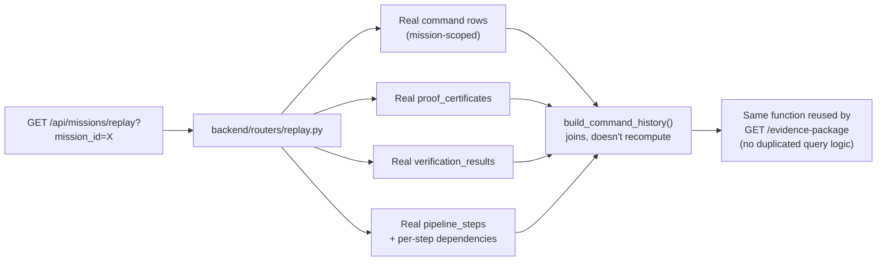

# Verification Pipeline (Proof-Carrying Commands)

This document describes the **locked research contribution** of First Light
precisely, so a reviewer can verify every claim against the code without
reading the whole codebase. Nothing in this file is aspirational — every
diagram maps to a specific real file and function.

**Status key used throughout:** 🟢 Implemented (real code, tested) · 🟡
Simulated (real computation, but not live spacecraft hardware) · ⚪ Future
Work (not implemented; see [`ROADMAP.md`](ROADMAP.md)).

## The core claim

A **producer** (ground-side, can be arbitrarily complex/AI-driven/untrusted)
proposes a command *and* a machine-checkable proof that the command is safe.
A **verifier** (flight-side, must be simple/fast/trustworthy) re-checks that
proof with cheap arithmetic — never re-solving the original optimization
problem. This is the textbook Proof-Carrying Code pattern applied to
spacecraft commanding. 🟢 Implemented: `producer/` (proposes), `backend/verifier.py`
(checks).

## Pipeline: propose → certificate → verify



### The 5 verifier steps (all in `backend/verifier.py`, all deterministic)

1. **Command hash match** — the submitted command bytes hash to the value the
   certificate claims.
2. **Signature valid** — real HMAC-SHA256 recomputation and constant-time
   compare (`hmac.compare_digest`).
3. **Sequence valid (replay protection)** — a single atomic SQL upsert:
   `INSERT ... ON CONFLICT DO UPDATE ... WHERE last_accepted_sequence < ?`.
   This is a genuine compare-and-swap, not a read-then-write race — see
   `eval/test_sequence_race.py` for the concurrency test.
4. **Model version match** — the dynamics model the certificate was derived
   against matches what the verifier expects.
5. **Farkas certificate valid** — cheap arithmetic recomputation confirming
   the certificate's multipliers actually derive a contradiction against the
   constraint system. This is the step that replaces re-solving the original
   Z3 problem — see below.

## What a Farkas certificate is, concretely

Farkas' lemma: a system of linear inequalities `Ax ≤ b` is infeasible if and
only if there exist non-negative multipliers `λ ≥ 0` such that `λᵀA = 0` and
`λᵀb < 0` — a certificate of infeasibility that's *cheap to check* even
though *finding* it can be expensive (Z3's job). The Proof Generator Agent
asks Z3 "is `unsafe ∧ dynamics ∧ command` infeasible?", and if UNSAT, derives
the real multiplier vector from Z3's own proof — not fabricated, not a
placeholder. The verifier's job is then pure arithmetic: does
`λᵀA = 0` and `λᵀb < 0` actually hold for *these* multipliers against *this*
command's actual numbers? 🟢 Implemented: `producer/certificate.py`
(derivation), `backend/verifier.py` (the cheap recheck).

**Currently implemented flight rule:** angular rate (a box constraint on
`||ω||`). 🟢. Additional rules (power, thermal, momentum, etc.) would need
their own multiplier-derivation generalization beyond the current one-hot
box-constraint construction — see [`ROADMAP.md`](ROADMAP.md). ⚪

## Audit chain

```mermaid
flowchart TD
    C1["Command 1<br/>hash, signature, sequence_no"] -->|chain_hash = H(prev + hash1 + sig1 + seq1)| L1["Link 1"]
    L1 --> C2["Command 2"]
    C2 -->|chain_hash = H(link1 + hash2 + sig2 + seq2)| L2["Link 2"]
    L2 --> C3["Command 3"]
    C3 -->|chain_hash = H(link2 + hash3 + sig3 + seq3)| L3["Link 3"]
    L3 -.->|GET /api/audit/verify| V["Independent recomputation<br/>🟢 walks every link, recomputes<br/>from each command's CURRENT<br/>actual hash/signature —<br/>never trusts stored chain_hash"]
```

Real Merkle/blockchain-style hash chaining (`backend/audit_chain.py`):
tampering with any past command's stored hash or signature breaks every
`chain_hash` computed after it, and `GET /api/audit/verify` independently
recomputes the whole chain from each command's *current* actual data —
it does not trust the stored `chain_hash` values. 🟢 Implemented, tested
(`eval/test_audit_chain.py`).

## Replay pipeline



Every field in a replay entry is a real historical row — nothing is
recomputed or re-simulated for replay. 🟢 Implemented.

## What is explicitly simulated, and disclosed as such

- `backend/digital_twin.py` — deterministic physics simulation (reuses the
  same `SpacecraftDynamics` the real pipeline uses for attitude propagation),
  **not live spacecraft telemetry**. 🟡 Simulated, documented as such
  everywhere it appears in the UI and API.
- The Attack Library's 7 scenarios are hand-constructed adversarial
  mutations, not recorded real-world attack traffic. 🟡 Simulated.

## What is not certified, and never implied to be

Not flight-qualified; not certified under NASA-STD-8719.13, DO-178C, or
ECSS-E-ST-40C. See [`docs/SAFETY_DISCLAIMER.md`](docs/SAFETY_DISCLAIMER.md).
No live NASA cFE/Software Bus build exists in this repository — `apps/gate`
and `apps/target` are a cFS-*pattern* C reference verifier, real HMAC/SHA-256
(RFC-vector tested), but never run under a real cFE. ⚪
